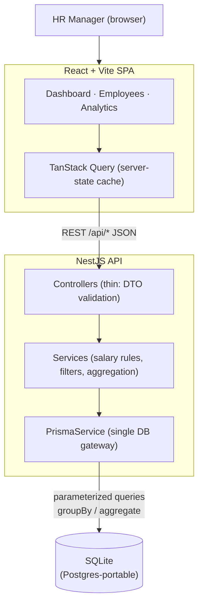
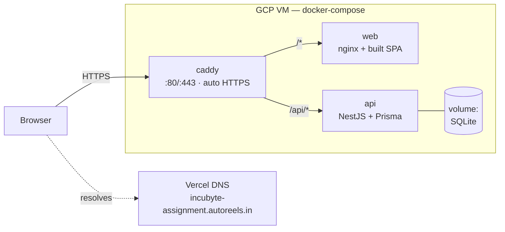

# Architecture — ACME Salary Management

_Design overview and the trade-offs behind it._

## System Overview



### Deployment topology



### Detailed view

```
┌──────────────────────────────────────────────────────────────────────┐
│                            Browser (HR Manager)                        │
│  React 19 + Vite SPA                                                    │
│  ┌─────────────┐  ┌──────────────┐  ┌───────────────────────────────┐  │
│  │ Employees    │  │ Analytics     │  │ shadcn/ui (Radix + Tailwind)  │  │
│  │ table + form │  │ dashboard     │  │ TanStack Query (server state) │  │
│  └─────────────┘  └──────────────┘  │ TanStack Table (paginated)     │  │
│                                       └───────────────────────────────┘  │
└───────────────────────────────┬────────────────────────────────────────┘
                                 │  HTTP / JSON (REST)
                                 ▼
┌──────────────────────────────────────────────────────────────────────┐
│                          NestJS API (TypeScript)                       │
│                                                                        │
│  Controller  ──►  Service (business logic)  ──►  PrismaService         │
│  (thin: DTO       (salary rules, filtering,      (single DB gateway)   │
│   validation)      aggregation)                                        │
│                                                                        │
│  Global ValidationPipe (whitelist) · HTTP exception filter             │
└───────────────────────────────┬────────────────────────────────────────┘
                                 │  Prisma Client (parameterized)
                                 ▼
                        ┌─────────────────────┐
                        │  SQLite (dev)        │   schema kept
                        │  Postgres (prod-opt) │   Postgres-portable
                        └─────────────────────┘
```

## Layers & Responsibilities

| Layer | Responsibility | Does NOT |
|---|---|---|
| **Controller** | HTTP shape: validate request via DTO, call service, return result | hold business logic or touch the DB |
| **Service** | All domain logic: salary rules, filter composition, aggregation | know about HTTP or build SQL strings |
| **PrismaService** | Single injectable gateway to the DB; parameterized queries | leak the client to multiple `new` instances |
| **Web feature hooks** | Fetch/caching via TanStack Query; expose typed data to components | embed business/money math in the render path |

This keeps the **domain logic framework-agnostic and unit-testable** — services are tested with a
mocked `PrismaService`, no HTTP or DB needed, which is what makes the test suite fast and deterministic.

## Data Model (initial)

```
Employee
  id          string (cuid)   PK
  name        string
  email       string          unique
  jobTitle    string
  department  string          (indexed)
  country     string          (indexed)     ISO country
  currency    string                         enum-constrained (USD/INR/EUR/GBP/AUD)
  salaryMinor int                            annual gross, minor units (cents) — never float
  status      string          (indexed)      active | inactive
  hireDate    datetime
  createdAt   datetime
  updatedAt   datetime
```

Indexes on `department`, `country`, `status`, and `salaryMinor` back the filter/sort/analytics paths.

## Key Decisions & Trade-offs

| Decision | Alternative | Why this choice |
|---|---|---|
| **SQLite + Prisma, Postgres-portable schema** | Hosted Postgres/Supabase from day one | Zero-setup, offline, deterministic tests + seeding for a take-home; one-line `datasource` swap to Postgres if a hosted deploy is wanted. No SQLite-only types used. |
| **Money as integer minor units + currency** | `float`/`Decimal` dollars | Integers eliminate rounding drift; explicit currency prevents silent cross-currency sums. `Decimal` was the runner-up; integers are simpler to assert in tests. |
| **DB-side aggregation** (`groupBy`/`aggregate`) | Load rows, aggregate in JS | Stays fast and constant-memory at 10k+ rows; pushes work to the engine built for it. |
| **Server-side pagination** | Ship all rows, paginate client-side | 10k rows over the wire and in the DOM is slow; server pagination keeps payloads small and the table snappy. |
| **REST** | GraphQL | The query surface is small and well-known; REST is simpler to test and reason about here. GraphQL's flexibility isn't needed for a single-persona tool. |
| **No auth (for now)** | JWT/RBAC | Single trusted persona; layered design lets a guard be added without reshaping the domain. See requirements "Out of Scope". |
| **Per-currency analytics** | Blended single number via FX | Honest and correct without a stale-rate dependency; conversion can be added later. |
| **Vitest** | Jest | Faster watch loop and simpler ESM/TS config; same runner for api + web reduces cognitive load. |

## Performance Posture (10k employees)

- All list endpoints paginate (`skip`/`take`) and return a total count for the filtered set.
- Filtering and analytics run in the DB with indexes on the filtered/sorted columns.
- The web table uses TanStack Table pagination — bounded DOM nodes regardless of dataset size.
- The seed is deterministic (fixed RNG seed) so performance and test runs are reproducible.

## Testing Strategy

- **Unit (fast, mocked Prisma):** salary/aggregation/filter logic, DTO validation, edge cases — written test-first.
- Thin controllers are covered indirectly; entity/schema declarations are not unit-tested.
- The suite is the inner TDD loop (`npm run test:watch`) and the pre-commit gate (`/verify`).

## Deployment (planned)

Single container: build the React SPA to static assets served by (or alongside) the NestJS API;
SQLite file on a persistent volume. A managed host (Render/Fly.io) or a Postgres swap is a config
change, not a rewrite — that's the point of keeping the schema portable.
